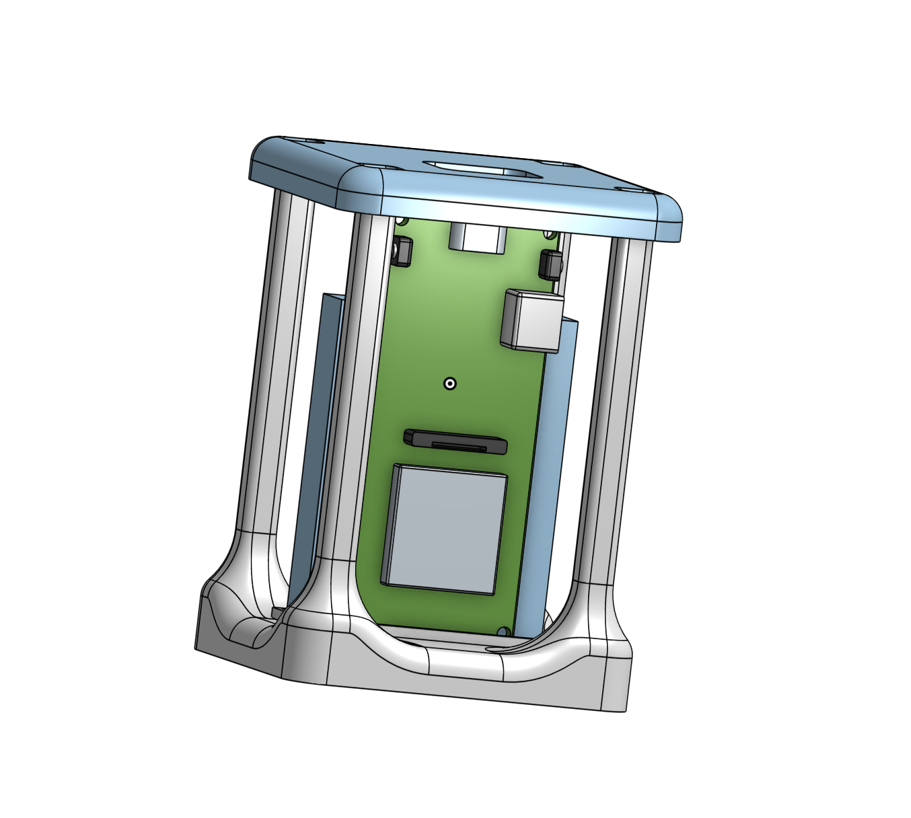
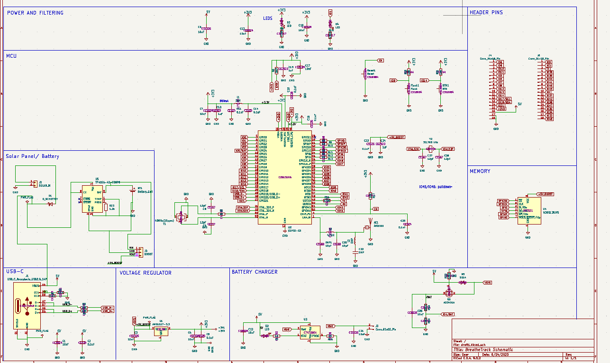
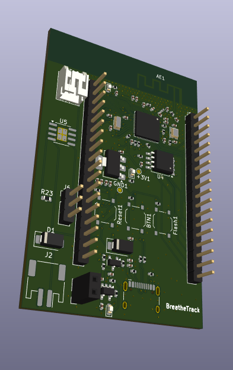

# BreatheTrack

### Project Description

This is a custom PCB we designed for our remote AQI sensing network called BreatheTrack. The BreatheTrack Network comprises of a central server with several AQI sensors that wirelessly transmit their sensor readings via HTTP through Flask. The BreatheTrack Sensors are built with the purpose to be inexpensive and minimal, providing key functionality without obstructing daily life.  

### Why we made it

A Single PCB reduces clutter and wiring issues from our initial prototype. Additionally, we have expanded functionality by adding support for a solar cell, which is accompanied by a Voltage regulator with protection to now allow the use of Lipo Batteries that can be charged through solar power. Additionally, PCBs significantly streamline our assembly process, allowing us to assemble multiple units in the time that it would take to assemble our original prototype. 

## Prototype CAD Design

## Fully Assembled Prototype 

## New PCB Schematic

## PCB 3D Render

## Bill of Materials (BOM)

| Component                           | Quantity | Price Estimate | Link |
|-------------------------------------|----------|----------------|------|
| PCB                                 | 1        | $60            | [JLCPCB](https://jlcpcb.com) |
| 6V 1W Solar Cell                     | 5        | $16            | [Amazon](https://www.amazon.com/gp/product/B0BML3PR4Z/ref=ox_sc_act_title_1?smid=A2MJCDED57HY1D&th=1) |
| MakerFocus ESP32 LoRa V3 Dev Board (with 2x SX1262 + 2x Battery) | 1 | $53 | [Amazon](https://www.amazon.com/gp/product/B0DMSGL2DC/ref=ox_sc_act_title_1?smid=A1N6DLY3NQK2VM&th=1) |
| Solar Panel Power Manager           | 1        | $14            | [Amazon](https://www.amazon.com/gp/product/B07MML4YJV/ref=ox_sc_act_title_4?smid=A2EH5PO307BR7O&psc=1) |
| Breadboard, Resistors, LEDs Kit     | 1        | $10            | [Amazon](https://www.amazon.com/dp/B01ERP6WL4) |
| Soldering Iron                      | 1        | $9             | [Amazon](https://www.amazon.com/Soldering-Welding-Portable-Electric-Repairing/dp/B098JD8HD3) |
| Total                        | 10          | $162             | N/A |

