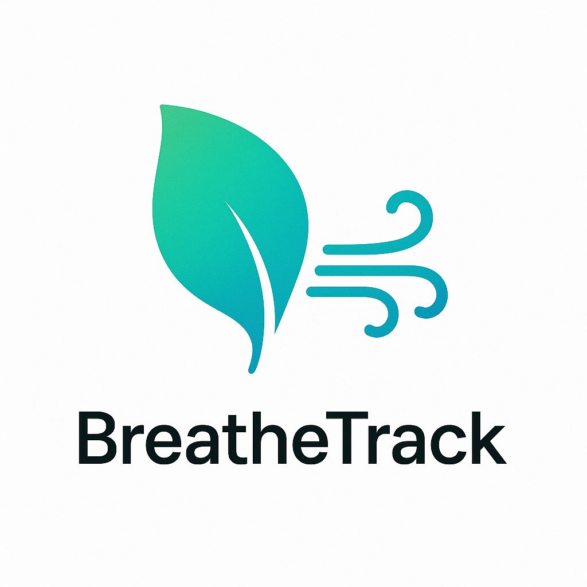
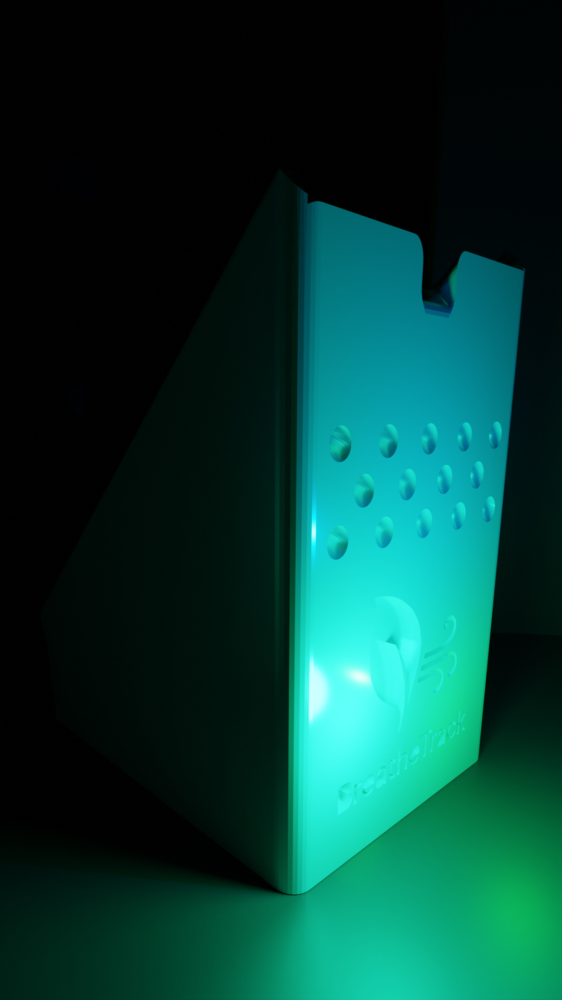

# BreatheTrack

## Prototype 1

## Assembled Prototype 1 

## Prototype 2

## Bill of Materials (BOM)

| Component                           | Quantity | Price Estimate | Link |
|-------------------------------------|----------|----------------|------|
| PCB                                 | 1        | $60            | [JLCPCB](https://jlcpcb.com) |
| 6V 1W Solar Cell                     | 5        | $16            | [Amazon](https://www.amazon.com/gp/product/B0BML3PR4Z/ref=ox_sc_act_title_1?smid=A2MJCDED57HY1D&th=1) |
| MakerFocus ESP32 LoRa V3 Dev Board (with 2x SX1262 + 2x Battery) | 1 | $53 | [Amazon](https://www.amazon.com/gp/product/B0DMSGL2DC/ref=ox_sc_act_title_1?smid=A1N6DLY3NQK2VM&th=1) |
| Solar Panel Power Manager           | 1        | $14            | [Amazon](https://www.amazon.com/gp/product/B07MML4YJV/ref=ox_sc_act_title_4?smid=A2EH5PO307BR7O&psc=1) |
| Breadboard, Resistors, LEDs Kit     | 1        | $10            | [Amazon](https://www.amazon.com/dp/B01ERP6WL4) |
| Soldering Iron                      | 1        | $9             | [Amazon](https://www.amazon.com/Soldering-Welding-Portable-Electric-Repairing/dp/B098JD8HD3) |
| Total                        | 10          | $162             | N/A |

